실종자 및 실종동물 정보 공유 플랫폼 (Disappearance Client)

프로젝트 소개
실종자 및 실종동물 정보 공유 플랫폼은 실종된 사람이나 동물을 찾기 위한 모바일 애플리케이션입니다. 사용자는 실종 정보를 등록하고, 다른 사람의 제보를 확인하며, 목격담을 공유할 수 있습니다. 지도를 통해 실종 위치 및 목격 위치를 시각적으로 확인하고, 채팅 기능을 통해 사용자 간의 소통을 돕습니다.

사용화면: 

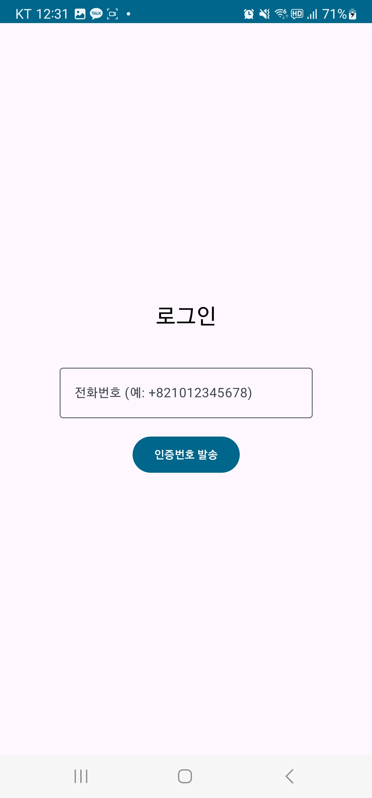 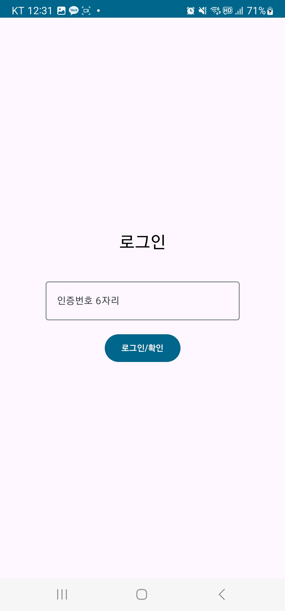

사용자 인증: Firebase Authentication과 휴대폰 본인인증을 연동하여, 모든 신고 정보의 신뢰성과 책임 추적성을 확보했습니다. 이를 통해 악의적인 허위 신고로부터 실종자를 보호하는 핵심적인 안전장치를 구현했습니다.

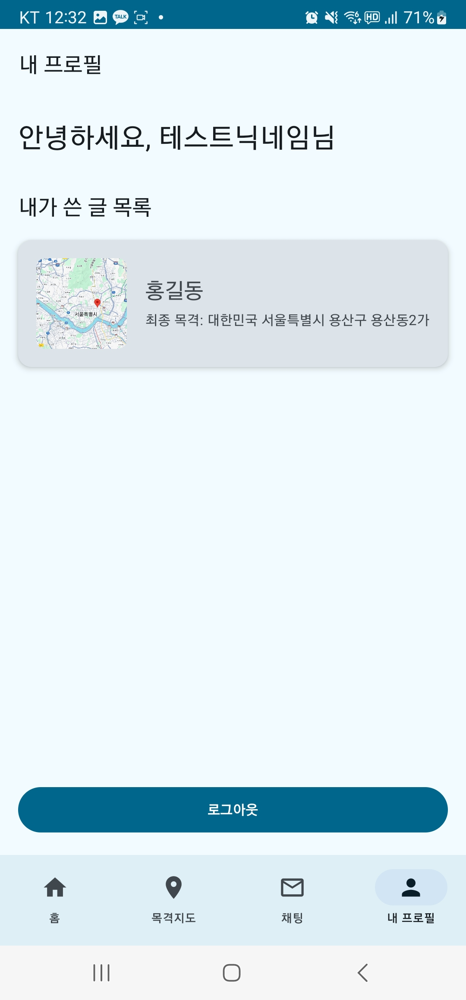 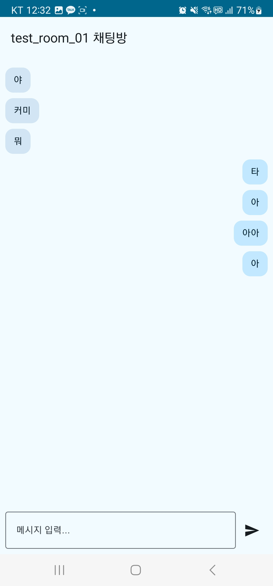
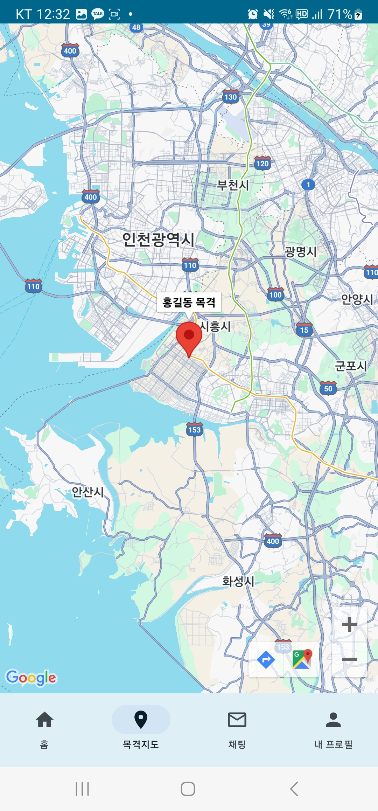
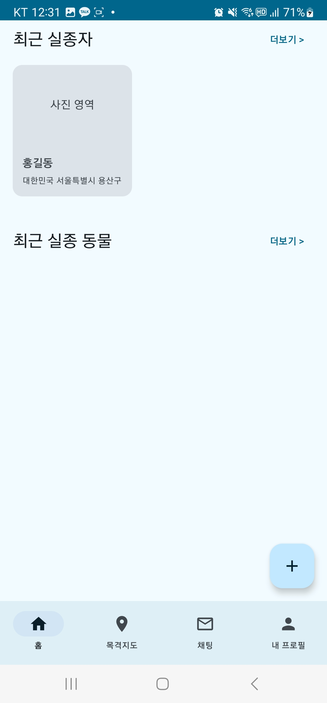

대시보드 및 지도 시각화: 로그인 후 접하는 홈 화면은 최신 실종 정보를 한눈에 파악할 수 있도록 대시보드 형태로 디자인했습니다. 목격담이 등록되면 해당 주소(Geocoder 활용)를 서버와 동기화하고, Naver Maps Compose SDK를 통해 지도 위에 즉시 시각화하여 실종자의 동선을 효과적으로 추적할 수 있도록 했습니다. UI는 전체적으로 Jetpack Compose를 사용하여 선언적이고 현대적인 방식으로 구현했습니다.

내 활동 관리 (CRUD): 사용자는 프로필 탭에서 본인이 작성한 모든 게시물 목록을 확인하고, 게시물을 수정하거나 삭제(CRUD)하는 등 자신의 활동을 직접 관리할 수 있습니다.

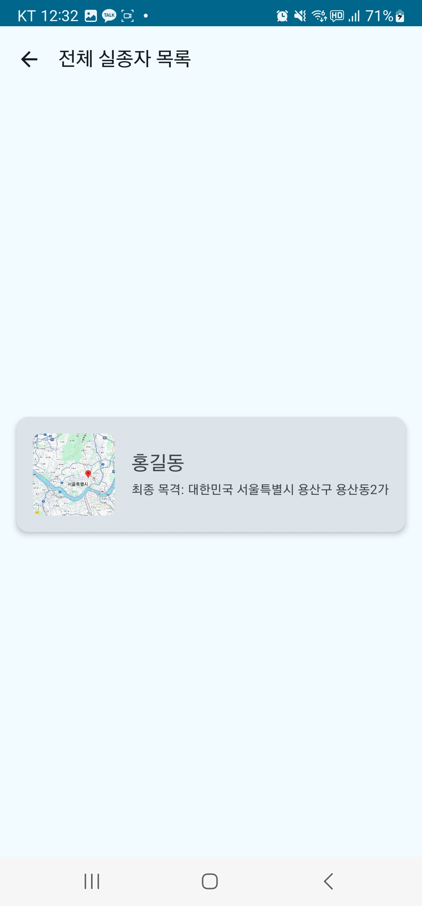

전체 실종 정보 조회: 홈 화면의 대시보드에서 '더보기'를 통해 전체 실종자 및 실종동물 목록을 확인할 수 있습니다. 서버로부터 받아온 데이터를 리스트 형태로 동적으로 표시합니다.

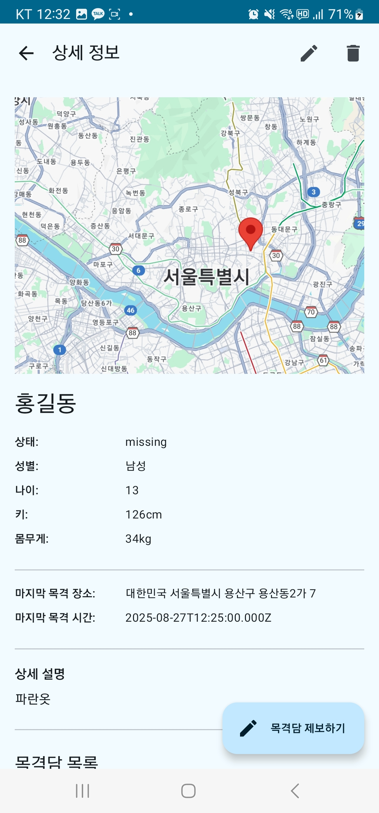

상세 정보 조회 및 게시물 관리(CRUD): 목록의 항목을 선택하면 상세 정보 페이지로 이동합니다. 서버로부터 전달받은 인증 정보를 기반으로 게시물의 소유권을 확인하여, 본인이 작성한 글일 경우에만 수정 및 삭제 버튼이 활성화되는 권한 제어 로직을 구현했습니다.

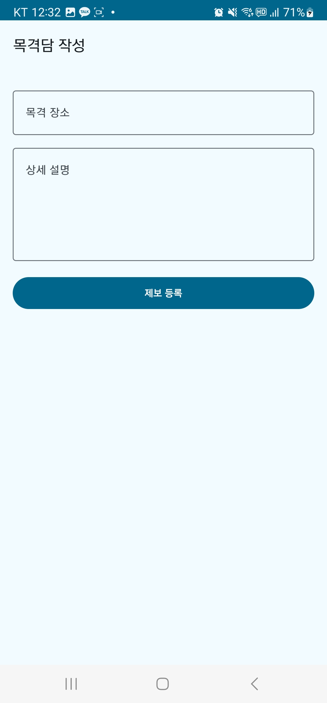

목격담 제보 및 지도 데이터 연동: 사용자는 목격 위치와 상세 정보를 입력하여 목격담을 제보할 수 있습니다. 제보가 등록되면, 해당 주소 정보는 서버에서 관리되며, 클라이언트는 이 데이터를 받아 Geocoder를 통해 좌표로 변환 후 실시간으로 지도 위에 새로운 마커를 표시하여 데이터의 시각적 동기화를 구현했습니다.

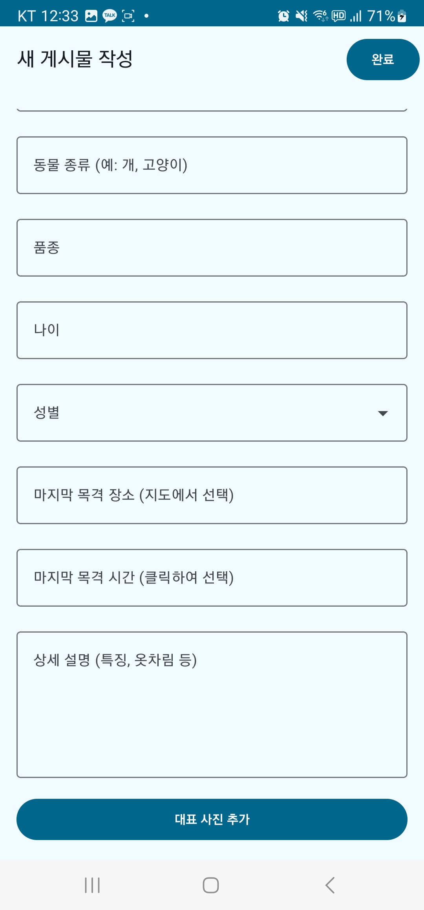 
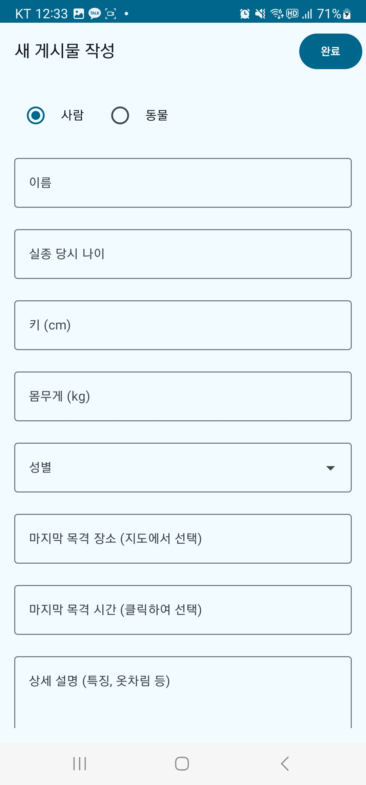

실종 정보 등록 : 긴급한 상황에서도 사용자가 필수 정보를 놓치지 않고 빠르게 입력할 수 있도록 직관적인 UI/UX로 설계했습니다. 

🛠️ 사용 기술
언어: Kotlin
UI: Jetpack Compose
아키텍처: MVVM (Model-View-ViewModel)
비동기 처리: Kotlin Coroutines
의존성 주입: Koin
네트워킹: Retrofit2, OkHttp3
네비게이션: Jetpack Navigation (Compose)
이미지 로딩: Coil
백엔드 및 데이터베이스:
API 서버: 자체 구축한 API 서버 사용 (EC2)
인증: Firebase Authentication
이미지 저장소: Firebase Storage
실시간 채팅: Firebase Realtime Database
지도: Google Maps Compose

Server (Backend & Infra)
런타임: Node.js
프레임워크: Express.js
데이터베이스: MySQL (AWS RDS)
웹 서버: Nginx (리버스 프록시로 활용)
인증서: Let's Encrypt (Certbot으로 자동 발급 및 갱신)
배포: AWS EC2
DNS: AWS Route 53
프로세스 관리: PM2

📂 프로젝트 구조                                                                                                                                                                                                                                        
disappearance_client/                                                                                                                                                                                                                                        
├── app/                                                                                                                                                                                                                                               
│   ├── src/                                                                                                                                                                                                                                        
│   │   ├── main/                                                                                                                                                                                                                                        
│   │   │   ├── java/com/example/awstestapp/                                                                                                                                                                                                                                        
│   │   │   │   ├── data/                    # 데이터 계층                                                                                                                                                                                                                                        
│   │   │   │   │   ├── local/               # Room 데이터베이스 관련                                                                                                                                                                                                                                        
│   │   │   │   │   ├── remote/              # Retrofit API, DTOs                                                                                                                                                                                                                                        
│   │   │   │   │   └── repository/          # Repository 구현체                                                                                                                                                                                                                                        
│   │   │   │   ├── di/                      # Koin 의존성 주입 모듈                                                                                                                                                                                                                                        
│   │   │   │   ├── domain/                  # 도메인 계층                                                                                                                                                                                                                                        
│   │   │   │   │   └── repository/          # Repository 인터페이스                                                                                                                                                                                       
│   │   │   │   ├── ui/                      # UI 계층                                                                                                                                                                                                     
│   │   │   │   │   ├── navigation/          # 네비게이션 경로 정의                                                                                                                                                                                         
│   │   │   │   │   ├── screens/             # 각 화면 Composable                                                                                                                                                                                          
│   │   │   │   │   ├── theme/               # 앱 테마 (Color, Type, Theme)                                                                                                                                                                                
│   │   │   │   │   └── viewmodel/           # ViewModel                                                                                                                                                                                                  
│   │   │   │   ├── MainActivity.kt          # 메인 액티비티                                                                                                                                                                                               
│   │   │   │   └── MyApplication.kt         # Koin 초기화                                                                                                                                                                                                 
│   │   │   ├── res/                       # 리소스 (Drawable, values 등)                                                                                                                                                                                  
│   │   └── AndroidManifest.xml                                                                                                                                                                                                                         
│   ├── build.gradle.kts                   # 앱 수준 build.gradle                                                                                                                                                                                          
└── build.gradle.kts                       # 프로젝트 수준 build.gradle                                                                                                                                                                                    
